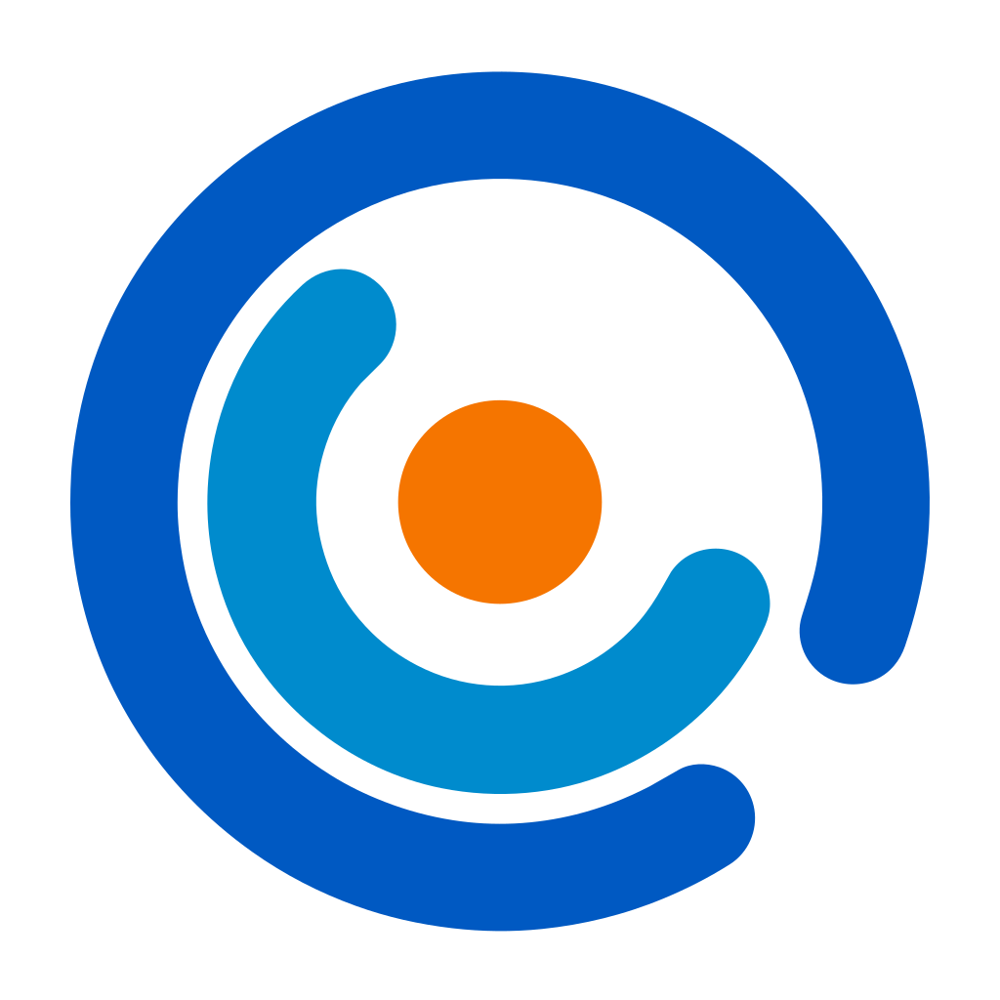

<p align="center">
  
</p>

# skenion

skenion is an open-source interactive artwork platform.

The core design is simple:

```text
Browser controls.
Rust renders.
The preview shows the Rust runtime's real output.
```

skenion pairs a web Studio for editing, control, and preview with a native Rust
runtime that owns graph compilation, scheduling, rendering, output, plugin
execution, preview generation, and runtime telemetry.

## Repository Family

skenion starts as a multi-repository project:

| Repository | Role |
| --- | --- |
| `skenion` | Project hub, compatibility matrix promotion, architecture, RFCs, ADRs, roadmap, governance |
| `skenion-docs` | Human-readable model docs for data delivery, processing, and object semantics |
| `skenion-contracts` | Protobuf, JSON Schema, OpenAPI, generated packages, conformance tests |
| `skenion-runtime` | Rust native runtime and CLI |
| `skenion-studio` | Mantine-based browser editor, controller, and viewer |
| `skenion-sdk` | TypeScript SDK for runtime connections, commands, and capability negotiation |
| `skenion-examples` | Example scenes, fixtures, sample projects, and compatibility examples |
| `skenion-ci` | Reusable GitHub Actions workflows and composite actions |

See [Repository Map](docs/repository-map.md) for ownership boundaries.
See [Compatibility Matrix](docs/compatibility-matrix.md) for graph/node/runtime
source-of-truth rules.
Human-readable delivery and processing model docs live in
[`skenion-docs`](https://github.com/skenion/skenion-docs); machine
contracts remain in `skenion-contracts`.
See [Local Demo](docs/local-demo.md) for the current Runtime + Studio learning
flow.
See [Roadmap](docs/roadmap.md) for the initial implementation order.

## Key Decisions

- Use Mantine as the primary frontend component system for `skenion-studio`.
- Use `@xyflow/react` as the Studio canvas interaction layer, with React Flow
  state treated only as a derived view model.
- Use Protobuf + Buf as the live TS/Rust control contract.
- Use JSON Schema for persisted graph/project documents.
- Use natural component releases for v0. Release Please owns repository-local
  versions, changelogs, release PRs, tags, and GitHub Releases; the hub verifies
  and promotes compatibility matrices instead of forcing equal product versions.
- Treat Contracts `0.45` as the first compatibility-matrix line. Component
  releases may be public but unpromoted until matrix verification passes.
- Publish importable library packages to registries only: `@skenion/contracts`,
  `skenion-contracts`, and `@skenion/sdk`. Runtime binaries, Studio web/desktop
  builds, examples, Manual pages, and `skenion-ci` are release assets, tags,
  deployments, or workflow refs.
- Publish registry packages, Runtime binaries, Studio desktop packages, and
  Manual releases through GitHub Actions only, never from a local machine.
- Use Tauri as the desktop shell for Studio; Tauri coordinates windows,
  sidecars, runtime profiles, and clipboard bridging while Runtime remains the
  graph authority.
- Treat realtime Runtime-authoritative collaboration, live help patch graphs,
  package marketplace install/update UX, and Runtime multi-arch binary artifacts
  as v0 foundation work.
- Require 100% test coverage for package-owned executable source, while keeping
  generated artifacts and thin integration shells explicitly out of scope.
- Keep control, media, telemetry, assets, and debug planes separate.
- Do not create a vague `common` repository.
- Use Apache-2.0 as the default open-source license and preserve credit through
  LICENSE, NOTICE, citation metadata, and trademark policy.

## Status

The project is in bootstrap. The initial work is defining repository boundaries,
contracts, release rules, and the MVP runtime/editor protocol.

## License And Credit

skenion is licensed under the Apache License, Version 2.0.

Redistributions must preserve copyright, license, and NOTICE information as
required by Apache-2.0. If skenion helps your artwork, research, publication,
installation, or tool, please credit skenion and its contributors.
